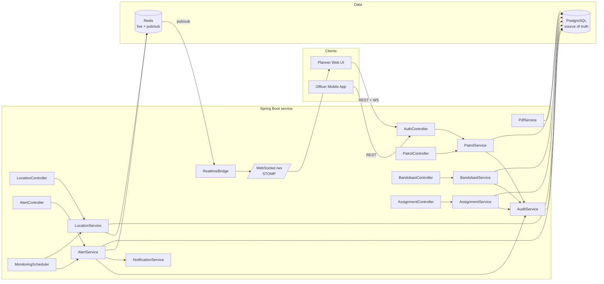

# Architecture

Authored by Krishnamurti.

## Component diagram

Source: [`architecture.svg`](architecture.svg) — renders directly on GitHub.

### Mermaid (same diagram, editable form)

## Why these boundaries

- **Identity / Planning / Field telemetry / Incident / Reporting / Audit** are picked because each has a distinct scaling and consistency story:
  - Identity is read-mostly, low QPS.
  - Planning is write-heavy but batched (shift changeover).
  - Field telemetry is high-frequency writes + high-frequency map reads.
  - Incident is bursty; latency-critical on PANIC.
  - Reporting is CPU-bound, occasional.
  - Audit is append-only and must not block business ops.
- Within a bounded context, entities and services sit together; across contexts we pass IDs, not JPA relationships, which keeps the split refactor cheap.

## Request lifecycle — GPS ping

1. Officer device POSTs `/api/locations/ping` with JWT.
2. `JwtAuthFilter` verifies token, sets `UserPrincipal` in the security context.
3. `LocationController` validates payload; `@PreAuthorize` requires `ROLE_OFFICER`.
4. `LocationService.record()`:
   a. persists to `location_pings`,
   b. writes `copmap:live:{officerId}` with TTL to Redis,
   c. publishes JSON to `copmap.location` channel.
5. Every app replica’s `RealtimeBridge` receives the pub/sub message and pushes to `/topic/locations` over STOMP.
6. Planner UIs subscribed to `/topic/locations` render the marker.

## Request lifecycle — PANIC alert

1. Officer POSTs `/api/alerts` with `type=PANIC, severity=CRITICAL`.
2. `AlertService.raise()`:
   a. persists row,
   b. publishes to `copmap.alerts`,
   c. dispatches to `NotificationService` (async),
   d. writes audit event.
3. `RealtimeBridge` → `/topic/alerts` → planners' dashboards light up.
4. Planner hits `/api/alerts/{id}/acknowledge` → status transitions → audit recorded.
