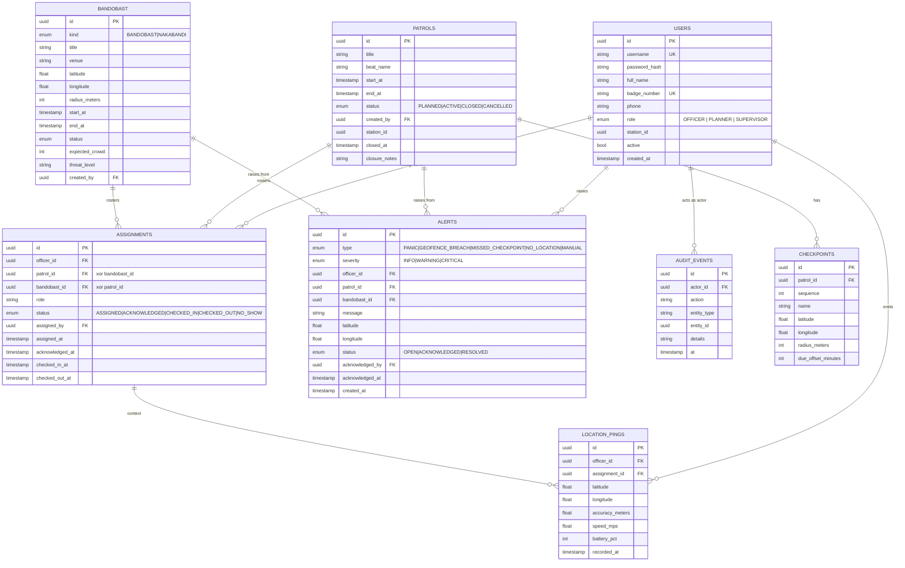

# Entity-Relationship diagram

Authored by Krishnamurti.

## Design notes

- **One assignment table, two foreign keys, XOR CHECK.** Keeps the "officer's current assignments" feed a single SELECT and gives audit a uniform row shape.
- **LOCATION_PINGS append-only**, PK on UUID, clustered read pattern on `(officer_id, recorded_at DESC)`. Redis carries the "latest" for the live map so this table is never read on the hot path.
- **AUDIT_EVENTS written in `REQUIRES_NEW`** so a rollback on the business operation doesn't remove the record that the attempt happened.
