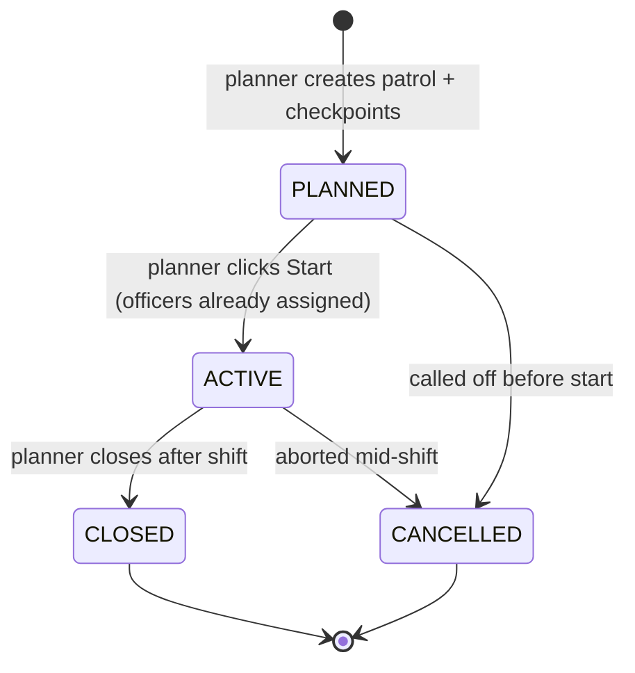
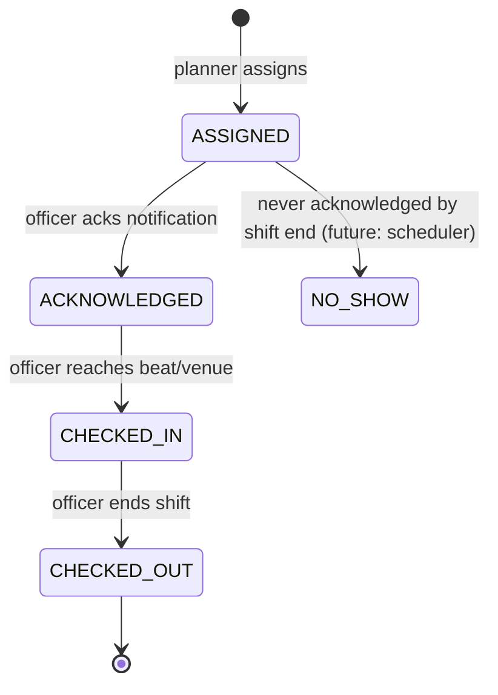
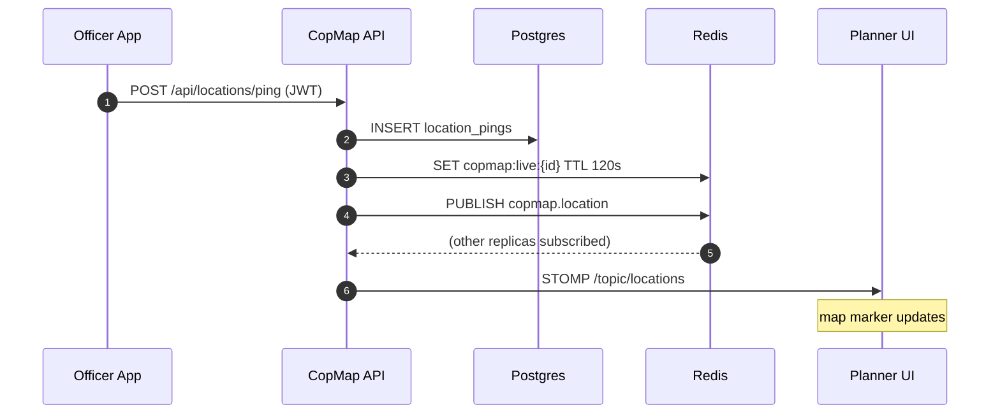
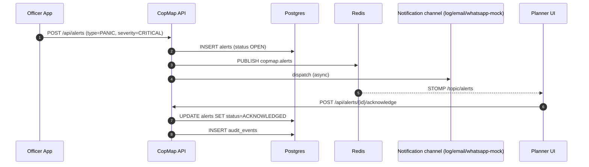

# Operational flows

Authored by Krishnamurti.

## Patrol lifecycle

Every transition writes an AUDIT_EVENT row and is allowed only via the explicit `canTransition()` function inside the service — the REST layer exposes `/start`, `/close`, `/cancel` rather than a generic PATCH to avoid illegal jumps.

## Bandobast / Nakabandi lifecycle

Identical state machine, additional fields in the aggregate (kind, venue, cordon radius, expected_crowd, threat_level).

## Assignment lifecycle (officer-side)

## Live monitoring sequence

## PANIC flow

